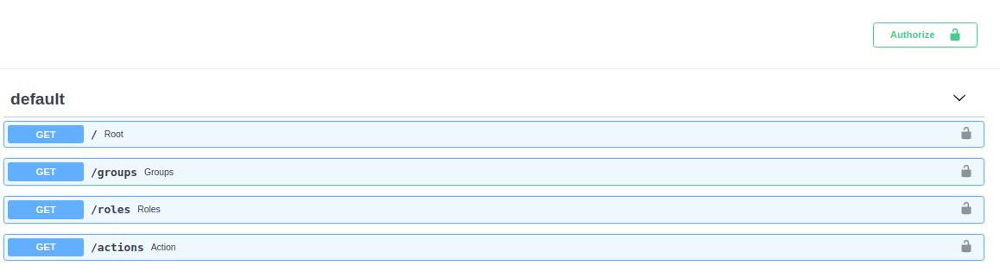
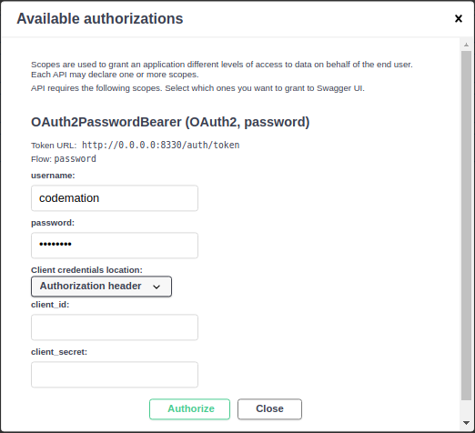

## Client

### Required Environment Varaibles
Configure require env variables via a .json
```Bash
$ cat > client_env.json <<EOF
{
    "KEY_PATH": "/my_key-location",
    "KEY_NAME": "test_key"
}
EOF
```
### Client Usage

```python
#test_client.py
from fastapi import FastAPI

from easyauth.client import EasyAuthClient

server = FastAPI()

@server.on_event('startup')
async def startup():
    server.auth = await EasyAuthClient.create(
        server, 
        'http://0.0.0.0:8330/auth/token', # Should be a running EasyAuthServer 
        env_from_file='client_env.json',
        default_permissoins={'groups': ['users']}
    )

    # grants access to users matching default_permissions
    @server.auth.get('/default')
    async def default():
        return f"I am default"

    # grants access to only specified users
    @server.auth.get('/', users=['jane'])
    async def root():
        return f"I am root"
    
    # grants access to members of 'users' or 'admins' group.
    @server.auth.get('/groups', groups=['users', 'admins'])
    async def groups():
        return f"I am groups"
    
    # grants access to all members of 'users' group 
    # or a groups with role of 'basic' or advanced
    @server.auth.get('/roles', roles=['basic', 'advanced'], groups=['users'])
    async def roles():
        return f"Roles and Groups"

    # grants access to all members of groups with a roles granting 'BASIC_CREATE'
    @server.auth.get('/actions', actions=['BASIC_CREATE'])
    async def action():
        return f"I am actions"
```
!!! NOTE "default_permissions, if unspecified"
    {'groups': ['administrators']}

### Permissions
EasyAuth allows endpoints to be as exclusive or as inclusive as needed. Authorization is granted if user meets at least 1 condition. 
```python
@server.auth.get(
    '/roles', 
    roles=['basic'],  # OR
    groups=['users'], # OR
    actions=['CREATE_BASIC'] 
)
```


