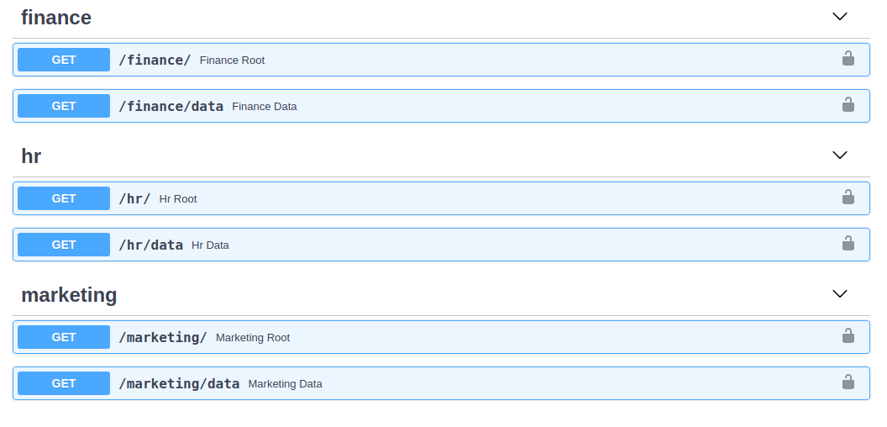
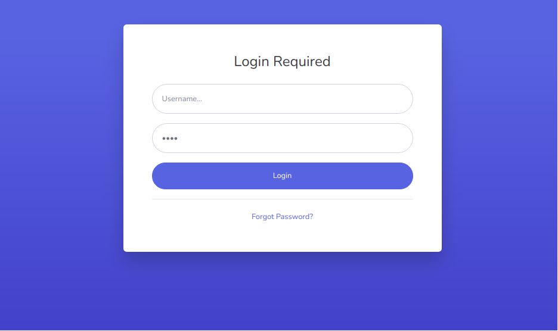
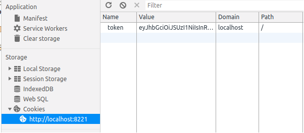

## Client

### Client Usage

```python
#test_client.py
from fastapi import FastAPI

from easyauth.client import EasyAuthClient

server = FastAPI()

@server.on_event('startup')
async def startup():
    server.auth = await EasyAuthClient.create(
        server,
        token_server='0.0.0.0',
        token_server_port=8090,
        auth_secret='abcd1234',
        default_permissions={'groups': ['users']}
    )

    # grants access to users matching default_permissions
    @server.auth.get('/default')
    async def default():
        return f"I am default"

    # grants access to only specified users
    @server.auth.get('/', users=['jane'])
    async def root():
        return f"I am root"

    # grants access to members of 'users' or 'admins' group.
    @server.auth.get('/groups', groups=['users', 'admins'])
    async def groups():
        return f"I am groups"

    # grants access to all members of 'users' group
    # or a groups with role of 'basic' or advanced
    @server.auth.get('/roles', roles=['basic', 'advanced'], groups=['users'])
    async def roles():
        return f"Roles and Groups"

    # grants access to all members of groups with a roles granting 'BASIC_CREATE'
    @server.auth.get('/actions', actions=['BASIC_CREATE'])
    async def action():
        return f"I am actions"
```
!!! NOTE "default_permissions, if unspecified"
    {'groups': ['administrators']}

### APIRouter
FastAPI provides a [APIRouter](https://fastapi.tiangolo.com/tutorial/bigger-applications/?h=apirouter#apirouter) object for defining path prefixes, pre-defined dependencies, see fastapi docs for more details. EasyAuthClient can extend the main FastAPI router using the .create_api_router() method or EasyAuthAPIRouter.create().

!!! Important - "EasyAuthAPIRouter Considerations "
    EasyAuthAPIRouter should be created after an `EasyAuthClient` or `EasyAuthServer` is created to ensure that the router are correctly included and visible in OpenAPI schema.

```python
from fastapi import FastAPI, Request, Depends
from fastapi.responses import HTMLResponse
from typing import Optional

from easyauth.client import EasyAuthClient

server = FastAPI(openapi_url="/groups/openapi.json")

@server.on_event('startup')
async def startup():
    server.auth = await EasyAuthClient.create(
        server,
        token_server='0.0.0.0',
        token_server_port=8090,
        auth_secret='abcd1234',
        default_permissions={'groups': ['users']}
    )

    # import sub modules
    from .finance import finance
    from .hr import hr
    from .marketing import marketing
```

```python
from easyauth.router import EasyAuthAPIRouter

finance_router = EasyAuthAPIRouter.create(prefix='/finance', tags=['finance'])

@finance_router.get('/')
async def finance_root():
    return f"fiance_root"

@finance_router.get('/data')
async def finance_data():
    return f"finance_data"

```
!!! TIP
    EasyAuthAPIRouter.create() and server.auth.create_api_router() are wrappers around FastAPI's APIRouter, accepting and passing the same arguments, but also automatically including the router at startup.

```
.
├── app
│   ├── __init__.py
│   ├── server.py
│   └── marketing
│   │   ├── __init__.py
│   │   ├── marketing.py
│   └── finance
│   │   ├── __init__.py
│   │   ├── finance.py
│   └── hr
│       ├── __init__.py
│       └── hr.py
```



### Permissions
EasyAuth allows endpoints to be as exclusive or as inclusive as needed. Authorization is granted if user meets at least 1 condition.
```python
@server.auth.get(
    '/roles',
    roles=['basic'],  # OR
    groups=['users'], # OR
    actions=['CREATE_BASIC']
)
```


### Cookies
EasyAuth client endpoints, decorated by the auth router, that serve HTML responses or static webcontent are provided default integrated login endpoints at /login /logout.




!!! Note
    Once logged in, the browser will contain a authenticatin cookie that matches the users token




### Page Overloads
It is possible to overload the existing login, register, activation, not_found, and forbidden pages using the page specific "overloader". Just like routers, this should be done after an EasyAuthClient is created.

!!! Danger
    Consider reviewing what API's are used / required before overloading any existing page. Oauth Login scripts are not loaded into overloaded pages.

#### Not Found - 404
```python
from easyauth.pages import NotFoundPage

@NotFoundPage.mark()
def custom_not_found_page():
    return "Custom 404 Page"

```
!!! TIP
    `NotFoundPage` contents is wrapped in an HTMLResponse with a status_code `404`.

#### Forbidden Page - 403
```python
from easyauth.pages import ForbiddenPage

@ForbiddenPage.mark()
def not_allowed_page():
    return "Custom 404 Page"
```
#### Login Page & 401
```python
from easyauth.pages import LoginPage

@LoginPage.mark()
def custom_login_page():
    return "Custom Login Page"

```

#### Register Page
```python
from easyauth.pages import RegisterPage

@RegisterPage.mark()
def custom_register_page():
    return "Custom Register Page"

```

#### Activation Page
```python
from easyauth.pages import ActivationPage

@ActivationPage.mark()
def custom_activation_page():
    return "Custom Login Page"

```

### Path Overloads
The default `/login` and 401 redirect path can be overloaded by setting the `default_login_path` on `EasyAuthClient.create()`.

```python
    server.auth = await EasyAuthClient.create(
        server,
        token_server='0.0.0.0',
        token_server_port=8090,
        auth_secret='abcd1234',
        default_permissions={'groups': ['users']},
        default_login_path='/v1/internal/login'
    )
```