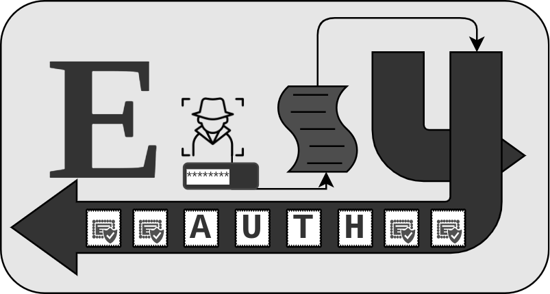
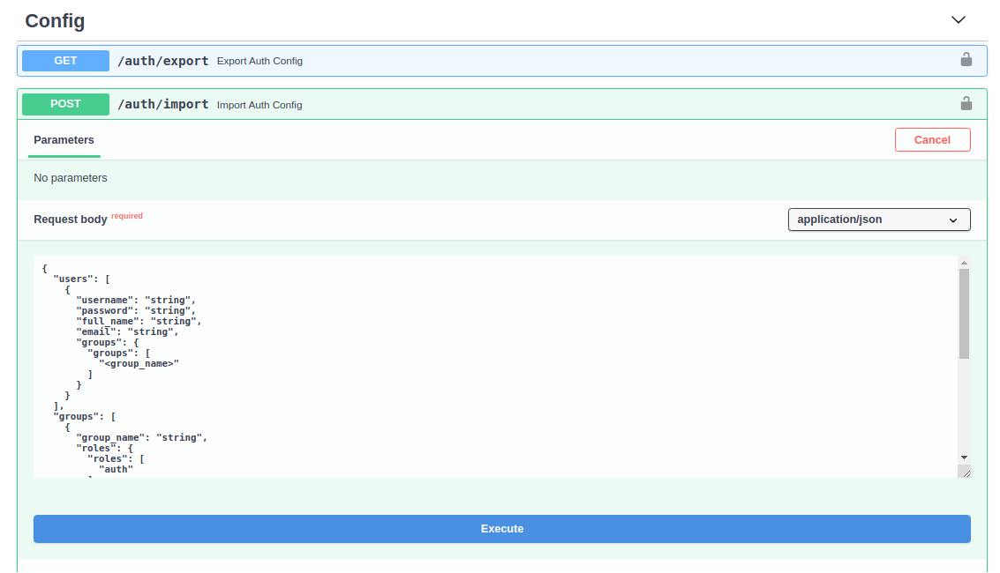
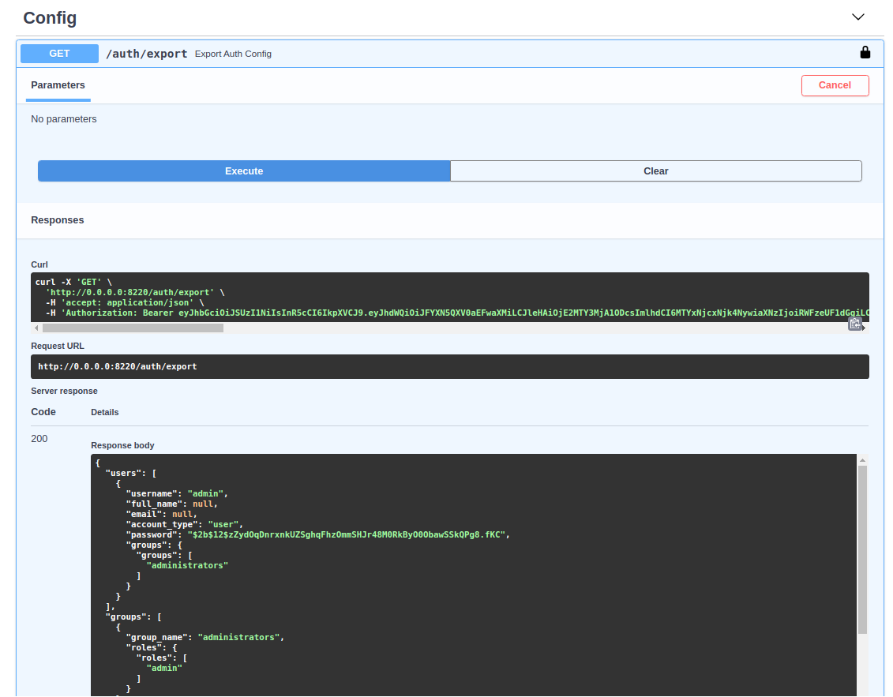

<br>

<h3>Create a centralized Authentication and Authorization token server </h3>

<h5>Easily secure FastAPI endpoints based on Users, Groups, Roles or Permissions with very little database usage. </h5>

#

### Quick Start

#### Installation
```bash

$ virtualenv -p <python3.X> easy-auth-env
$ source easy-auth-env/bin/activate

(easy-auth) $ pip install easy-auth[all]

(easy-auth) $ pip install easy-auth[server] 

(easy-auth) $ pip install easy-auth[client] # without db 

```
###  Basic Server

#### Set Required Env Variables
!!! TIP "Preparing Env Variables"
    Configure require env variables via a .json
```bash
$ cat > server_env.json <<EOF
{
    "DB_TYPE": "sqlite",
    "DB_NAME": "auth",
    "ISSUER": "EasyAuth",
    "SUBJECT": "EasyAuthAuth",
    "AUDIENCE": "EasyAuthApis",
    "KEY_PATH": "/my_key-location",
    "KEY_NAME": "test_key"
}
EOF
```
!!! NOTE "Manually set env variables"
    $ export VAR=VALUE


#### Create Server 
```python
#test_server.py
from fastapi import FastAPI

from easyauth.server import EasyAuthServer

server = FastAPI()

@server.on_event('startup')
async def startup():
    server.auth = await EasyAuthServer.create(
        server, 
        '/auth/token',
        env_from_file='server_env.json'
    )

``` 
!!! SUCCESS "Start Server"
    $ uvicorn --host 0.0.0.0 --port 8330 test_server:server

!!! TIP "First Startup"
    When a server is started for the first time, detected by table creation (database tables not existing yet), a new admin user / group / role / action is created automatically, search in logs for # the password:

```
01-25 10:32 EasyAuthServer ERROR    detected new EasyAuth server, created admin user with password: ymbuvwop
```

### Keys
When an EasyAuthServer starts, it checks the provided KEY_NAME  & KEY_PATH location for existing keys, if none exist they are created.
<br>

```bash 
$ ls test_key*
test_key.key  test_key.pub
```
<br>

!!! Warning "Important .key file must be kept safe!"
    Do not store in the paths monitored by git to avoid accidental commit.

    The .pub file should be copied to any separate apps which you want to use this EasyAuthServer.

    If either key is, ever lost, they will be re-created on the EasyAuthServer in the KEY_PATH location upon restart. 

    If a .key is re-created, the new .pub key must be copied to all EasyAuthClients

### API

This new admin user is required to access the APIs pre-created at
the listening server location:
```bash
01-25 10:32 uvicorn.error INFO     Application startup complete.
INFO:     Uvicorn running on http://0.0.0.0:8330 (Press CTRL+C to quit)
```
!!! INFO
    Navigate to 0.0.0.0:8330/docs


### Basic Client

#### Required Environment Varaibles
Configure require env variables via a .json
```Bash
$ cat > client_env.json <<EOF
{
    "KEY_PATH": "/my_key-location",
    "KEY_NAME": "test_key"
}
EOF
```
#### Client Usage

```python
#test_client.py
from fastapi import FastAPI

from easyauth.client import EasyAuthClient

server = FastAPI()

@server.on_event('startup')
async def startup():
    server.auth = await EasyAuthClient.create(
        server, 
        'http://0.0.0.0:8330/auth/token', # Should be a running EasyAuthServer 
        env_from_file='client_env.json',
        default_permissoins={'groups': ['users']}
    )

    # grants access to users matching default_permissions
    @server.auth.get('/default')
    async def default():
        return f"I am default"

    # grants access to only specified users
    @server.auth.get('/', users=['jane'])
    async def root():
        return f"I am root"
    
    # grants access to members of 'users' or 'admins' group.
    @server.auth.get('/groups', groups=['users', 'admins'])
    async def groups():
        return f"I am groups"
    
    # grants access to all members of 'users' group 
    # or a groups with role of 'basic' or advanced
    @server.auth.get('/roles', roles=['basic', 'advanced'], groups=['users'])
    async def roles():
        return f"Roles and Groups"

    # grants access to all members of groups with a roles granting 'BASIC_CREATE'
    @server.auth.get('/actions', actions=['BASIC_CREATE'])
    async def action():
        return f"I am actions"
```
!!! NOTE "default_permissions"
    set to {'groups': ['administrators']} if unspecifeid

### Permissions
EasyAuth allows endpoints to be as exclusive or as inclusive as needed. Authorization is granted if user meets at least 1 condition. 
```python
@server.auth.get(
    '/roles', 
    roles=['basic'],  # OR
    groups=['users'], # OR
    actions=['CREATE_BASIC'] 
)
```


### User Types

!!! INFO "user"
    Requests Token by providing sending username & password to EasyAuthServer at /auth/token. 
!!! INFO "service"
    Token must be generated by a user in administrators group - no password exist for service accounts 

### Tokens

When providing a username & password, the EasyAuthServer returns a Bearer Token containing all the users permissions. 

#### Expiration
!!! TIP "User Token Expiration"
    Expires after ~ 60 Minutes
!!! TIP "Service Token Expiration"
    Expires ~900 days 

### Database Usage
!!! TIP 
    The default 'batteries mostly included' implementation utilizes a sqlite database managed by aiopyql.

!!! INFO "Supported Databases"
- sqlite
- mysql
- postgres

### Import / Export Config

#### Importing
Pre-existing / Backup configuration can be added via Import Auth Config, or existing entries will be updated. 

!!! TIP "Auth Dependencies"
    Dependencies are added first, and missing dependencies will be indicated

!!! DANGER
    Importing will override existing configuration listed in the request body



#### Exporting
Auth Configuration can be exported to JSON to quickly review all configuration, save as a backup, restore in a new location / database. 

!!! TIP "Exporting Configuration"
    Export exisiting configuration to a JSON file containing all configuers users, groups, roles & permissions.




### Preparing a env.json
```bash
cat > server_env.json << EOF
{
    "DB_TYPE": "mysql",
    "DB_NAME": "auth",
    "DB_HOST": "0.0.0.0",
    "DB_PORT": "3306",
    "DB_USER": "mysqluser",
    "DB_PASSWORD": "my-secret",
    "ISSUER": "EasyAuth",
    "SUBJECT": "EasyAuthAuth",
    "AUDIENCE": "EasyAuthApis",
    "KEY_PATH": "/home/josh/Documents/python/EasyAuth/EasyAuth",
    "KEY_NAME": "test_key"
}
EOF
```
