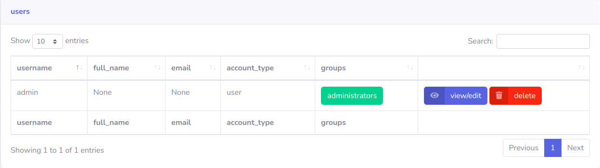
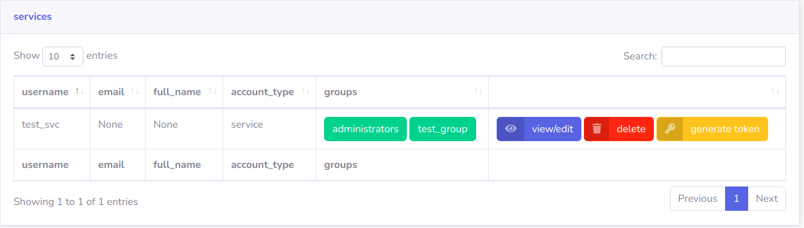
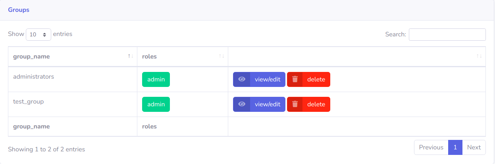
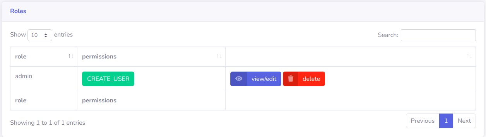
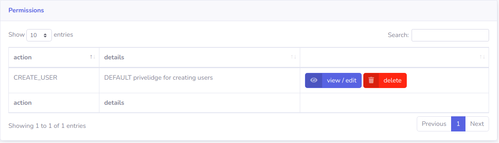

## RBAC
RBAC, or Role based access control, provides users with very specific sets of permissions based on assigned Groups, Roles, & Actions

### User
And end-user / service that accesses an endpoint.

#### Type - user

!!! INFO "user"
    A user requests a token by providing sending username & password to EasyAuthServer at /auth/token.

#### Type - service
!!! INFO "service"
    Tokens for services must be generated by a user in administrators group - no password exist for service accounts

#### Permissions
Permissions are derived from the group or groups assigned to the specific user.

### Group
Assigned to Users, and containing a list of specified roles.

Permissions are  derived from the roles assigned to the specific group.

### Role
Assigned to Groups, and containing a list of actions.

Permissions are derrived from the Actions assigned to the specific Role

### Action
Actions are the most granuar permission that can be created to define something that can be allowed.

### Tokens
Tokens are created for a specifc user, that contain the full permissions tree for a specific user (Groups, Roles, Actions)

#### User Token - Expiration

!!! TIP "user token"
    Expires after ~ 60 Minutes

#### Service Token - Expiration

!!! TIP "service token"
    Expires ~900 days

!!! TIP "Consideration on Cookies"
    Cookies are invalidated by the EasyAuthClient if the token inside the cookie has expired.

#### Revoking a Token
Once a token is created, it is valid until expiration or EasyAuthServer key rotation.

EasyAuthServer maintains a token registry of issued tokens, containing the underlying username, issue date, expiraiton_date & token_id.

EasyAuthServer updates all EasyAuthServer workers & connected EasyAuthClients when a token is added / revoked.

!!! TIP
    Tokens listed in the registry are seen as valid, and tokens which are revoked or do not exist in the registry, will return a 403.