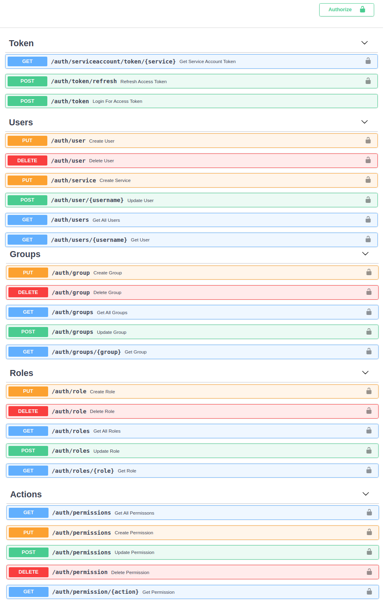
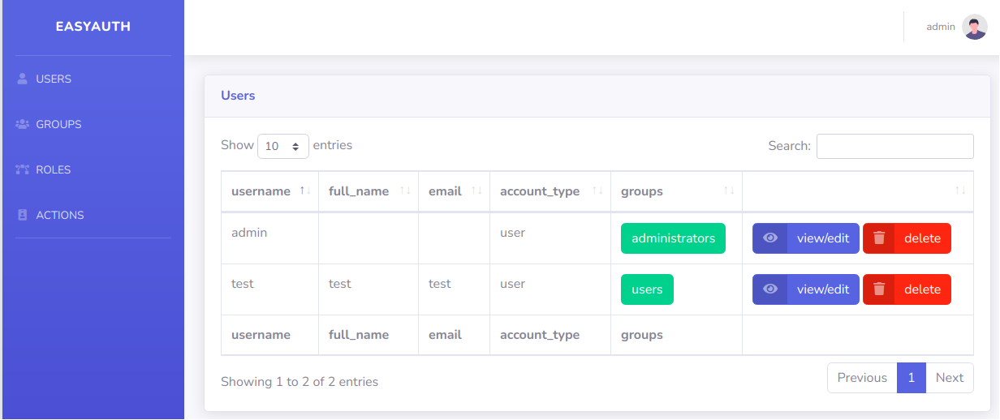

## Server

### Set Required Env Variables
!!! TIP "Preparing Env Variables"
    Configure require env variables via a .json
```bash
$ cat > server_env.json <<EOF
{
    "DB_TYPE": "sqlite",
    "DB_NAME": "auth",
    "ISSUER": "EasyAuth",
    "SUBJECT": "EasyAuthAuth",
    "AUDIENCE": "EasyAuthApis",
    "KEY_PATH": "/my_key-location",
    "KEY_NAME": "test_key"
}
EOF
```
!!! NOTE "Manually set env variables"
    $ export VAR=VALUE


### Create Server 
```python
#test_server.py
from fastapi import FastAPI

from easyauth.server import EasyAuthServer

server = FastAPI()

@server.on_event('startup')
async def startup():
    server.auth = await EasyAuthServer.create(
        server, 
        '/auth/token',
        env_from_file='server_env.json'
    )

``` 
!!! SUCCESS "Start Server"
    $ uvicorn --host 0.0.0.0 --port 8330 test_server:server

!!! TIP "First Startup"
    When a server is started for the first time, detected by table creation (database tables not existing yet), a new admin user / group / role / action is created automatically, search in logs for # the password:

```
01-25 10:32 EasyAuthServer ERROR    detected new EasyAuth server, created admin user with password: ymbuvwop
```

### Keys
When an EasyAuthServer starts, it checks the provided KEY_NAME  & KEY_PATH location for existing keys, if none exist they are created.
<br>

```bash 
$ ls test_key*
test_key.key  test_key.pub
```
<br>

!!! Warning "Important .key file must be kept safe!"
    Do not store in the paths monitored by git to avoid accidental commit.

    The .pub file should be copied to any separate apps which you want to use this EasyAuthServer.

    If either key is, ever lost, they will be re-created on the EasyAuthServer in the KEY_PATH location upon restart. 

    If a .key is re-created, the new .pub key must be copied to all EasyAuthClients

### API

This new admin user is required to access the APIs pre-created at
the listening server location:
```bash
01-25 10:32 uvicorn.error INFO     Application startup complete.
INFO:     Uvicorn running on http://0.0.0.0:8330 (Press CTRL+C to quit)
```
!!! INFO
    Navigate to 0.0.0.0:8330/docs


### GUI
