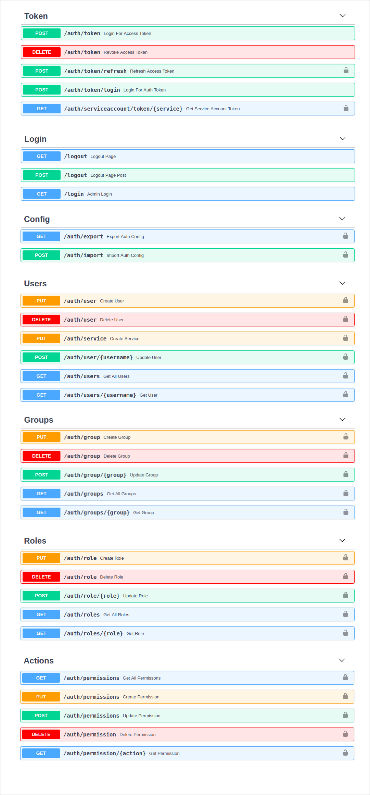
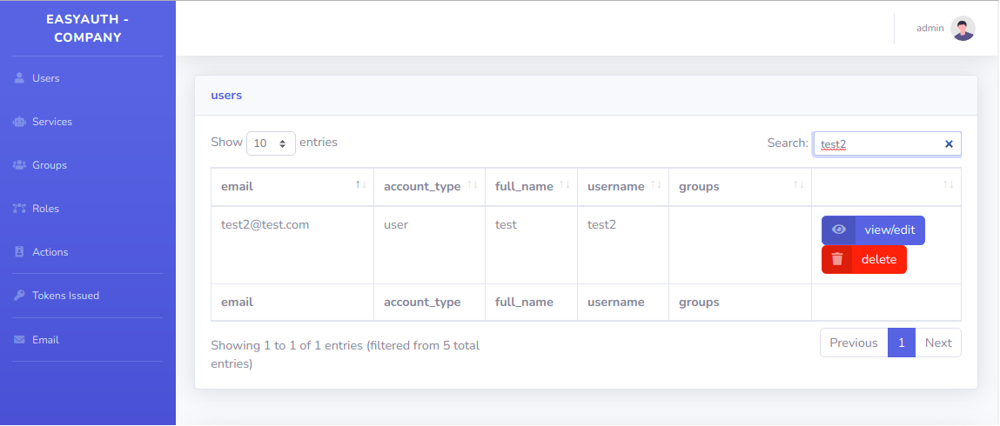
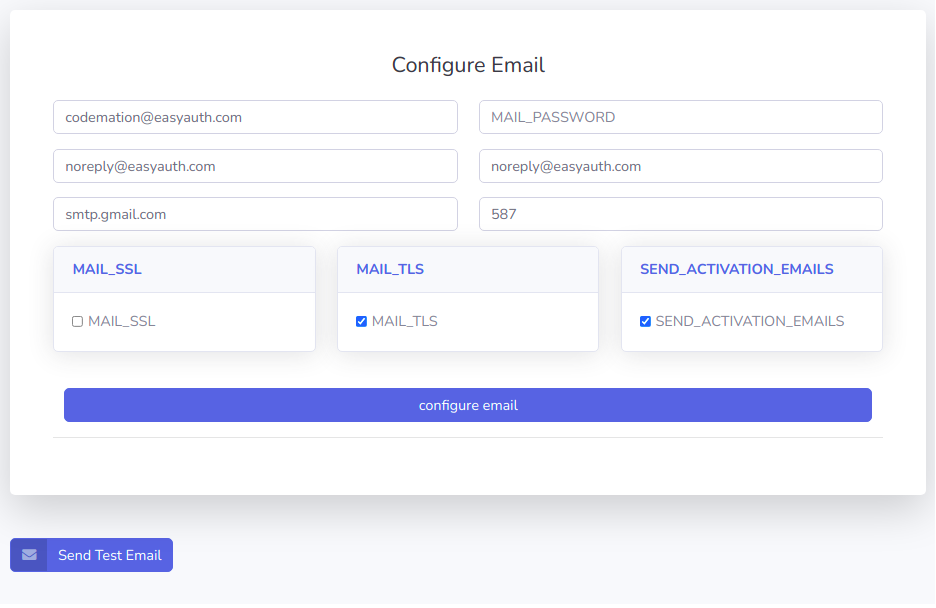
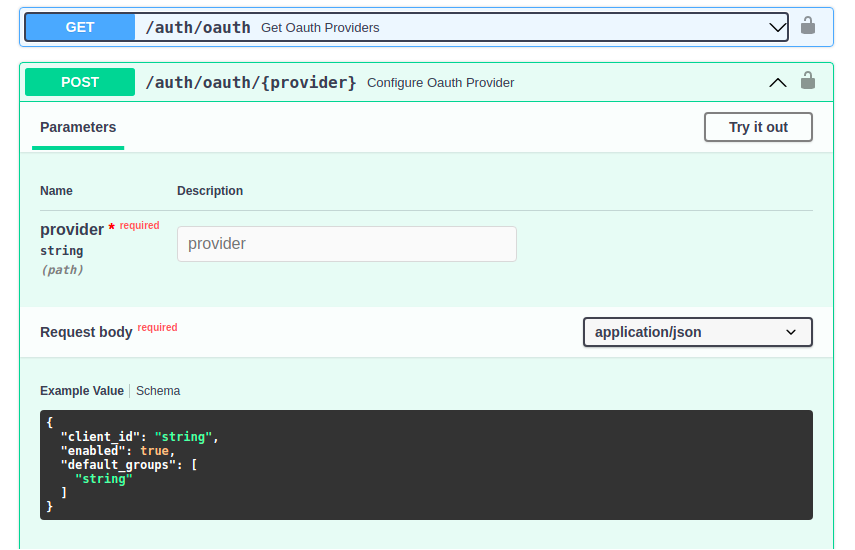
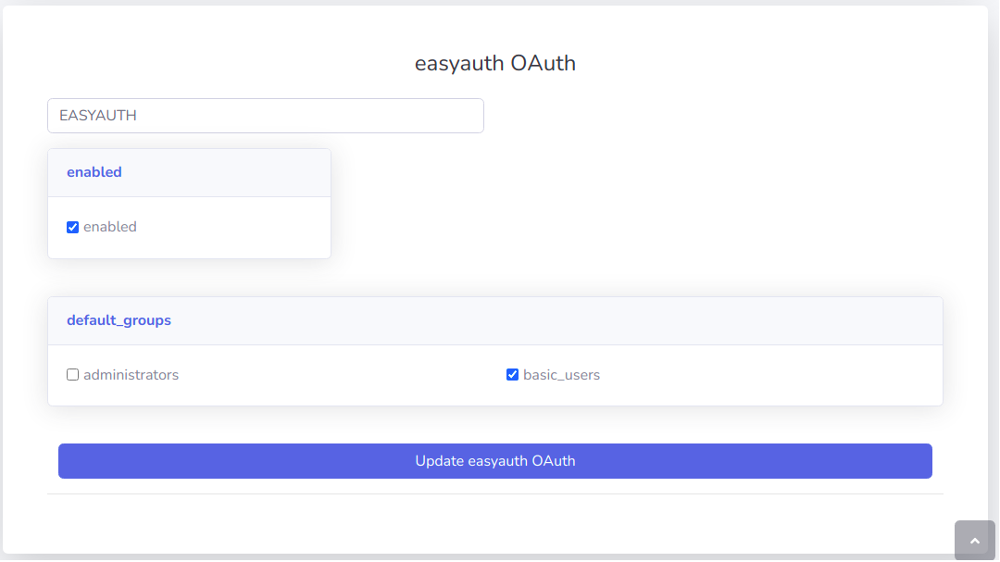
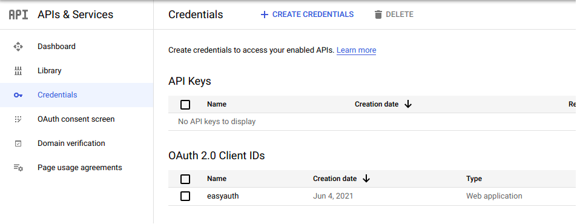
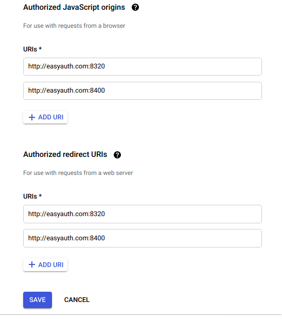
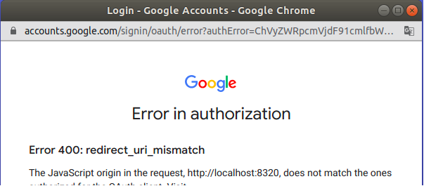

## Server

### Set Required Env Variables
!!! TIP "Preparing Env Variables"
    Configure require env variables via a .json
```bash
$ cat > server_sqlite.json <<EOF
{
    "DB_TYPE": "sqlite",
    "DB_NAME": "auth",
    "ISSUER": "EasyAuth",
    "SUBJECT": "EasyAuthAuth",
    "AUDIENCE": "EasyAuthApis",
    "KEY_PATH": "/my_key-location",
    "KEY_NAME": "test_key"
}
EOF
```
!!! NOTE "Manually set env variables"
    $ export VAR=VALUE


### Create Server 
```python
#test_server.py
from fastapi import FastAPI

from easyauth.server import EasyAuthServer

server = FastAPI()

@server.on_event('startup')
async def startup():
    server.auth = await EasyAuthServer.create(
        server, 
        '/auth/token',
        auth_secret='abcd1234',
        admin_title='EasyAuth - Company',
        admin_prefix='/admin',
        env_from_file='server_sqlite.json'
    )

``` 
!!! SUCCESS "Start Server"
    $ uvicorn --host 0.0.0.0 --port 8330 test_server:server

!!! TIP "First Startup"
    When a server is started for the first time, detected by table creation (database tables not existing yet), a new admin user / group / role / action is created automatically, search in logs for # the password:

```
01-25 10:32 EasyAuthServer ERROR    detected new EasyAuth server, created admin user with password: ymbuvwop
```

### Keys
When an EasyAuthServer starts, it checks the provided KEY_NAME  & KEY_PATH location for existing keys, if none exist they are created.
<br>

```bash 
$ ls test_key*
test_key.key  test_key.pub
```
<br>

!!! Warning "Important .key file must be kept safe!"
    Do not store in the paths monitored by git to avoid accidental commit.

    The .pub file may be copied to separate apps which you want to may want to verify the validity of tokens on. 

    EasyAuthClients will automatically pull the public key from the EasyAuthSever at startup.

    If either key is, ever lost, they will be re-created on the EasyAuthServer in the KEY_PATH location upon restart. 

### APIRouter
FastAPI provides an [APIRouter](https://fastapi.tiangolo.com/tutorial/bigger-applications/?h=apirouter#apirouter) object for defining path prefixes, pre-defined dependencies, see fastapi docs for more details. EasyAuthServer can extend the main FastAPI router using the <b>.create_api_router()</b> method. 

!!! Important - "EasyAuthAPIRouter Considerations "
    EasyAuthAPIRouter should be created after an `EasyAuthClient` or `EasyAuthServer` is created to ensure that the router are correctly included and visible in OpenAPI schema.  

```python
from fastapi import FastAPI
from easyauth.server import EasyAuthServer

server = FastAPI()

@server.on_event('startup')
async def startup():
    server.auth = await EasyAuthServer.create(
        server, 
        '/auth/token',
        auth_secret='abcd1234',
        admin_title='EasyAuth - Company',
        admin_prefix='/admin',
        env_from_file='server_sqlite.json'
    )

    # import sub modules
    from .finance import finance
    from .hr import hr
    from .marketing import marketing
```

```python
from easyauth.router import EasyAuthAPIRouter

finance_router = EasyAuthAPIRouter.create(prefix='/finance', tags=['finance'])

@router.get('/')
async def finance_root():
    return f"fiance_root"

@router.get('/data')
async def finance_data():
    return f"finance_data"

```
!!! TIP
    server.auth.create_api_router() is a wrapper around FastAPI's APIRouter, accepting and passing the same arguments, but also automatically including the router at startup.

```
.
├── app
│   ├── __init__.py
│   ├── server.py
│   └── marketing
│   │   ├── __init__.py
│   │   ├── marketing.py
│   └── finance
│   │   ├── __init__.py
│   │   ├── finance.py
│   └── hr
│       ├── __init__.py
│       └── hr.py
```


### API

This new admin user is required to access the APIs pre-created at
the listening server location:
```bash
01-25 10:32 uvicorn.error INFO     Application startup complete.
INFO:     Uvicorn running on http://0.0.0.0:8330 (Press CTRL+C to quit)
```
!!! INFO
    Navigate to 0.0.0.0:8330/docs


### GUI
The EasyAuth Admin GUI is accessible by accessing the listening host:port at the defined <b>admin_prefix</b> location.
!!! INFO "GUI URL"
    http://0.0.0.0/{admin_prefix} <br>
    http://0.0.0.0/admin



### Docker 

#### Start Auth Server

```bash
mkdir -p $(pwd)/easyauth-vol

docker run --name easyauth \
    -e DB_TYPE=sqlite \
    -e DB_NAME=auth \
    -e DB_LOCAL_PATH=/mnt/easyauth \
    -e ISSUER=EasyAuth \
    -e SUBJECT=EasyAuthAuth \
    -e AUDIENCE=EasyAuthApis \
    -e KEY_PATH=/mnt/easyauth \
    -e KEY_NAME=test_key \
    -e AUTH_SECRET=my-secret \
    -e ADMIN_PREFIX="/admin" \
    -e ADMIN_TITLE="EasyAuth - Example" \
    -e AUTH_WORKERS=1 \
    -v $(pwd)/easyauth-vol:/mnt/easyauth \
    -p 8220:8220 \
    -d joshjamison/easyauth:v0.0.1
```

#### Pull Adminstrator Password from logs

```bash
$ docker logs easyauth[2021-04-23 15:36:07 +0000] [6] [INFO] Starting gunicorn 20.1.0[2021-04-23 15:36:07 +0000] [6] [INFO] Listening at: http://0.0.0.0:8220 (6)
[2021-04-23 15:36:07 +0000] [6] [INFO] Using worker: uvicorn.workers.UvicornWorker
[2021-04-23 15:36:07 +0000] [8] [INFO] Booting worker with pid: 8
[2021-04-23 15:36:07 +0000] [8] [INFO] Started server process [8]
[2021-04-23 15:36:07 +0000] [8] [INFO] Waiting for application startup.
04-23 15:36 EasyAuthServer ERROR    detected new EasyAuth server, created admin user with password: cwmykhzj
[2021-04-23 15:36:09 +0000] [8] [INFO] Application startup complete.
```

### Email

An EasyAuthServer may be configured to use an SMTP server. The EasyAuthServer and connected EasyAuthClients can utilize the email server for the following:

- sending activation codes for new user registrations 
- sending password reset emails


!!! TIP
    Default endpoints for register exist at /register 


!!! TIP
    Default endpoints for activate exist at /activate 

### Identity Providers
Identity providers configuration is provided to allow third party authentications services to integrate within EasyAuth permissions. 

#### API


#### Default Permissions 
<b>default_groups</b> provides a means to automatically assign new users to a group wether via /register or google login. 

#### EasyAuth



#### Google 
EasyAuth can be enabled to support registering / login from authenticated Google users

!!! TIP "Pre-Requisites"
    * google client ID
    * configured Authorized Javascript Origins & redirect URI's


!!! WARNING
    If no <b>default_groups</b> are configured for the Google Identity Provider, new users will default to EasyAuth provider's <b>default_groups</b>. 


##### Setup Google Client ID






!!! Note "Note on EasyAuthClients"
    EasyAuthClient inherit the ability use a EasyAuthServers Google configuration, but still require associating the clients URIs http://client-name:port/ from the google console. 

!!! TIP 
    In testing Google authentication locally, redirect your local DNS in /etc/hosts 

```bash
$ cat /etc/hosts
127.0.0.1	localhost easyauth.com easyauth-client.com
```

!!! TIP "Troubleshooting"
    Use browser developer tools to view browser console logs 
    Ctrl + shift + i 



Updating Browser Path to overriden host path, login should then be possible if correctly configured in google console